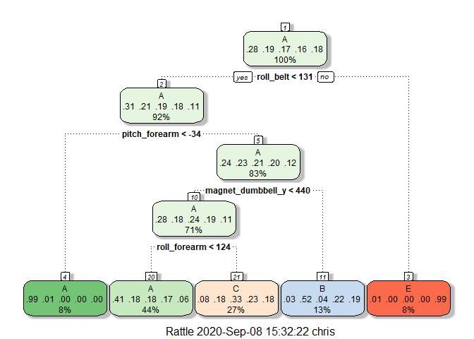

JHU Practical Machine Learning: Course Project
================
Chris Tomlinson

# Overview

Using devices such as Jawbone Up,Nike FuelBand, and Fitbit it is now
possible to collect a large amount of data about personal activity
relatively inexpensively. In this project, we use data from
accelerometers on the belt, forearm, arm, and dumbell of 6 participants.
They were asked to perform barbell lifts correctly and incorrectly in 5
different ways.

### Reference:

Ugulino, W.; Cardador, D.; Vega, K.; Velloso, E.; Milidiu, R.; Fuks, H.
Wearable Computing: Accelerometers’ Data Classification of Body Postures
and Movements. Proceedings of 21st Brazilian Symposium on Artificial
Intelligence. Advances in Artificial Intelligence - SBIA 2012. In:
Lecture Notes in Computer Science. , pp. 52-61. Curitiba, PR: Springer
Berlin / Heidelberg, 2012. ISBN 978-3-642-34458-9. DOI:
10.1007/978-3-642-34459-6\_6.

Read more: <http://groupware.les.inf.puc-rio.br/har#ixzz6XSVlnCnr>

## Task

To predict the “classe” variable in the training set, using any of the
other variables

# Getting Data

``` r
trainURL = "https://d396qusza40orc.cloudfront.net/predmachlearn/pml-training.csv"
testURL = "https://d396qusza40orc.cloudfront.net/predmachlearn/pml-testing.csv"
training = read.csv(trainURL, stringsAsFactors = T)
testing = read.csv(testURL, stringsAsFactors = T)
```

# Cleaning Data

``` r
library(caret)
```

    ## Warning: package 'caret' was built under R version 4.0.2

    ## Loading required package: lattice

    ## Loading required package: ggplot2

    ## Warning: package 'ggplot2' was built under R version 4.0.2

``` r
# Remove identifiers
training = training[,-c(1:5)]
testing = testing[,-c(1:5)]

# Remove NAs
colsNA = colSums(is.na(training)) == 0
training = training[ , colsNA] # Remove NA cols
testing = testing[ , colsNA]

# Remove Near Zero Variance variables
nZV = nearZeroVar(training) # returns vector of cols
training = training[, -nZV]
testing = testing[, -nZV]
```

After an initial exploratory analysis, not shown in the interests of
space, the data was cleaned in the following manner:  
\* Identifiers removed - num\_window, roll\_belt, pitch\_belt,
yaw\_belt, total\_accel\_belt these variables have no value for
prediction  
\* 0 cols of NA values were removed which again will have no predictive
value  
\* 34 near-Zero Variables were removed which again will have no
predictive value

# Partition Data

The ‘testing’ dataset actually represents 20 cases for the quiz, so I
have renamed it to quiz to avoid confusion.

The training data is then partitioned into 70% training / 30% testing to
allow evaluation of out-of-sample error rates.

``` r
quizData = testing
inTrain  = createDataPartition(training$classe, p=0.7, list=FALSE)
trainData = training[inTrain, ]
testData = training[-inTrain, ]
dim(trainData)
```

    ## [1] 13737    54

``` r
dim(testData)
```

    ## [1] 5885   54

# Models

## Model 1: Classification Tree

Classification trees, using the `rpart` method in `caret` are one of the
more interpretable ML methods so I elected to use try this first.

``` r
modRpart = train(classe ~ ., trainData, method ="rpart")
library(rattle)
```

    ## Warning: package 'rattle' was built under R version 4.0.2

    ## Loading required package: tibble

    ## Loading required package: bitops

    ## Rattle: A free graphical interface for data science with R.
    ## Version 5.4.0 Copyright (c) 2006-2020 Togaware Pty Ltd.
    ## Type 'rattle()' to shake, rattle, and roll your data.

``` r
fancyRpartPlot(modRpart$finalModel)
```

<!-- -->

``` r
predRpart = predict(modRpart, testData)
cmRpart = confusionMatrix(predRpart, testData$classe)
cmRpart
```

    ## Confusion Matrix and Statistics
    ## 
    ##           Reference
    ## Prediction    A    B    C    D    E
    ##          A 1525  484  499  423  153
    ##          B   29  385   37  187  159
    ##          C  116  270  490  354  289
    ##          D    0    0    0    0    0
    ##          E    4    0    0    0  481
    ## 
    ## Overall Statistics
    ##                                           
    ##                Accuracy : 0.4895          
    ##                  95% CI : (0.4767, 0.5024)
    ##     No Information Rate : 0.2845          
    ##     P-Value [Acc > NIR] : < 2.2e-16       
    ##                                           
    ##                   Kappa : 0.3324          
    ##                                           
    ##  Mcnemar's Test P-Value : NA              
    ## 
    ## Statistics by Class:
    ## 
    ##                      Class: A Class: B Class: C Class: D Class: E
    ## Sensitivity            0.9110  0.33802  0.47758   0.0000  0.44455
    ## Specificity            0.6298  0.91319  0.78823   1.0000  0.99917
    ## Pos Pred Value         0.4945  0.48306  0.32258      NaN  0.99175
    ## Neg Pred Value         0.9468  0.85181  0.87723   0.8362  0.88870
    ## Prevalence             0.2845  0.19354  0.17434   0.1638  0.18386
    ## Detection Rate         0.2591  0.06542  0.08326   0.0000  0.08173
    ## Detection Prevalence   0.5240  0.13543  0.25811   0.0000  0.08241
    ## Balanced Accuracy      0.7704  0.62560  0.63291   0.5000  0.72186

The Classification Tree is summarised in the above `fancyRpartPlot` from
the `rattle` package. Whilst very interpretable it unfortunately only
has an accuracy rate of 0.4895497 and thus an unacceptably high
out-of-sample error rate of 0.5104503.

## Model 2: Random Forest

Random Forests are one of the most accurate model types, but
computationally demanding. On my initial run it took almost 1 hour to
train\! I have therefore used the `doParallel` library, [following Len
Greski’s
tutorial](https://github.com/lgreski/datasciencectacontent/blob/master/markdown/pml-randomForestPerformance.md)
to enable parallel processing, which reduced the computation time to
about 20 mins. I’m also using `cache=TRUE` in the chunk header to
prevent having to re-train the model each time I knit the document.

I have used `traincontrol()` to specify 5-fold cross-validation.

``` r
library(parallel); library(doParallel)
```

    ## Warning: package 'doParallel' was built under R version 4.0.2

    ## Loading required package: foreach

    ## Warning: package 'foreach' was built under R version 4.0.2

    ## Loading required package: iterators

    ## Warning: package 'iterators' was built under R version 4.0.2

``` r
cluster = makeCluster(detectCores() - 1) # leave 1 core for OS
registerDoParallel(cluster)
fitControl = trainControl(method = "cv",number = 5,
                          allowParallel = TRUE)
modRF = train(classe ~ ., trainData, method ="rf", 
                          trcontrol=fitControl)
stopCluster(cluster); registerDoSEQ()
modRF$finalModel
```

    ## 
    ## Call:
    ##  randomForest(x = x, y = y, mtry = param$mtry, trcontrol = ..1) 
    ##                Type of random forest: classification
    ##                      Number of trees: 500
    ## No. of variables tried at each split: 27
    ## 
    ##         OOB estimate of  error rate: 0.2%
    ## Confusion matrix:
    ##      A    B    C    D    E  class.error
    ## A 3904    1    0    0    1 0.0005120328
    ## B    4 2650    3    1    0 0.0030097818
    ## C    0    6 2390    0    0 0.0025041736
    ## D    0    0    9 2242    1 0.0044404973
    ## E    0    0    0    2 2523 0.0007920792

``` r
predRF = predict(modRF, testData)
cmRF = confusionMatrix(predRF, testData$classe)
cmRF
```

    ## Confusion Matrix and Statistics
    ## 
    ##           Reference
    ## Prediction    A    B    C    D    E
    ##          A 1674    1    0    0    0
    ##          B    0 1138    2    0    0
    ##          C    0    0 1024    2    0
    ##          D    0    0    0  961    1
    ##          E    0    0    0    1 1081
    ## 
    ## Overall Statistics
    ##                                           
    ##                Accuracy : 0.9988          
    ##                  95% CI : (0.9976, 0.9995)
    ##     No Information Rate : 0.2845          
    ##     P-Value [Acc > NIR] : < 2.2e-16       
    ##                                           
    ##                   Kappa : 0.9985          
    ##                                           
    ##  Mcnemar's Test P-Value : NA              
    ## 
    ## Statistics by Class:
    ## 
    ##                      Class: A Class: B Class: C Class: D Class: E
    ## Sensitivity            1.0000   0.9991   0.9981   0.9969   0.9991
    ## Specificity            0.9998   0.9996   0.9996   0.9998   0.9998
    ## Pos Pred Value         0.9994   0.9982   0.9981   0.9990   0.9991
    ## Neg Pred Value         1.0000   0.9998   0.9996   0.9994   0.9998
    ## Prevalence             0.2845   0.1935   0.1743   0.1638   0.1839
    ## Detection Rate         0.2845   0.1934   0.1740   0.1633   0.1837
    ## Detection Prevalence   0.2846   0.1937   0.1743   0.1635   0.1839
    ## Balanced Accuracy      0.9999   0.9994   0.9988   0.9983   0.9994

We can see that after so much computation the Random Forest gives an
accuracy of 0.9988105 and thus a out-of-sample error rate of 0.0011895
which will be pretty hard to improve upon\!

## Model 3: Gradient Boosted Model

Finally I will use a Gradient Boosted Model via `method="gbm"` as
boosting is often very accurate, whilst being more computationally
efficient than Random Forests. Given the long time computing the Random
Forest took GBM might provide a better ‘real-world’ method.

``` r
cluster = makeCluster(detectCores() - 1)
registerDoParallel(cluster)
fitControl = trainControl(method = "repeatedcv", number = 5, repeats = 1, allowParallel = TRUE)
modGBM  = train(classe ~ ., data=trainData, method = "gbm", trControl = fitControl, verbose = FALSE)
stopCluster(cluster); registerDoSEQ()
modGBM$finalModel
```

    ## A gradient boosted model with multinomial loss function.
    ## 150 iterations were performed.
    ## There were 53 predictors of which 53 had non-zero influence.

``` r
predGBM = predict(modGBM, testData)
cmGBM = confusionMatrix(predGBM, testData$classe)
cmGBM
```

    ## Confusion Matrix and Statistics
    ## 
    ##           Reference
    ## Prediction    A    B    C    D    E
    ##          A 1663   12    0    0    0
    ##          B   10 1113   10    3    5
    ##          C    0   14 1015   21    2
    ##          D    1    0    1  940    4
    ##          E    0    0    0    0 1071
    ## 
    ## Overall Statistics
    ##                                           
    ##                Accuracy : 0.9859          
    ##                  95% CI : (0.9825, 0.9888)
    ##     No Information Rate : 0.2845          
    ##     P-Value [Acc > NIR] : < 2.2e-16       
    ##                                           
    ##                   Kappa : 0.9822          
    ##                                           
    ##  Mcnemar's Test P-Value : NA              
    ## 
    ## Statistics by Class:
    ## 
    ##                      Class: A Class: B Class: C Class: D Class: E
    ## Sensitivity            0.9934   0.9772   0.9893   0.9751   0.9898
    ## Specificity            0.9972   0.9941   0.9924   0.9988   1.0000
    ## Pos Pred Value         0.9928   0.9755   0.9648   0.9937   1.0000
    ## Neg Pred Value         0.9974   0.9945   0.9977   0.9951   0.9977
    ## Prevalence             0.2845   0.1935   0.1743   0.1638   0.1839
    ## Detection Rate         0.2826   0.1891   0.1725   0.1597   0.1820
    ## Detection Prevalence   0.2846   0.1939   0.1788   0.1607   0.1820
    ## Balanced Accuracy      0.9953   0.9856   0.9908   0.9869   0.9949

We can see that the GBM returns an accuracy of 0.9858963 and thus a
out-of-sample error rate of 0.0141037. Not quite as good as the Random
Forest but still pretty excellent and about 1/20th the computational
time\!

# Predictions for the Quiz

Using our best model, the Random Forest, on the quiz dataset generates
the following predictions which I will submit to Coursera.

``` r
results = predict(modRF, quizData)
results
```

    ##  [1] B A B A A E D B A A B C B A E E A B B B
    ## Levels: A B C D E
